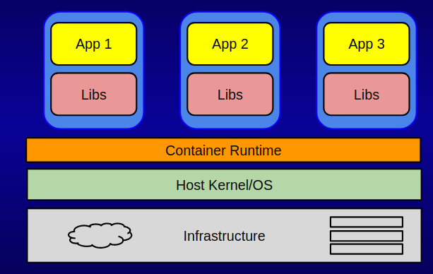

## NOTES/TODO
- Should we use jupyter as a docker example? 
- create a class client for all test accounts
- 

- Add intro to jupyter (before docker)
- ssh to vm, start jupyter
- log in to notebook - (test this)
- show jupyter ennvironment 

- then introduce docker
- introduce the same stuff but replace with classifier image
- build classifier image

- intro to abaco
- agavepy or curl? both?  

- 


# Intro to Docker

### What is a Container?

* Isolated Userland processes
* Virtualize: Network, I/O, CPU, and memory
* Rooted file system means all application assets contained within container; promotes:
  * Portability
  * Reproducibility
  * Ease of installation




### Containers vs VMs
* Containers
  * OS process level isolation
  * Can run 1,000s of containers on a single machine
  * Leverages kernel features (requirements on kernel version)
  * Start up time ~100ms
  
* VMs
  * OS level isolation with virtualized hardware
  * Can run dozens of VMs on a single machine
  * Leverages hypervisors (requirements on physical hardware)
  * Start up time ~minutes

### The Docker Platform
Docker is a platform (among serveral) for building and executing containers.

* Images - Container “templates”. Essentially root filesystems with a little metadata (exposed ports, volumes, etc.)
* Container runtime - Create containers from images and run commands in them. 
* Docker Hub - Central, public repository of images.
* Additional Tooling: 
    * Additional client APIs - run commands in containers, get resources consumed, view logs, 
    * Docker Compose, Machine, Swarm - Tools for distributing containers across multiple hosts

### Initial setup
Typically, accessing the docker daemon requires root to be in the docker group. For the purposes of this introduction,
 we can simply do everything as the root user:
```
$ sudo su - root
```
TODO - check version

Make sure you can access the docker daemon; you can verify this by checking the version:
```
$ docker version
Client:
 Version:      1.13.1
 API version:  1.26
 Go version:   go1.6.2
 Git commit:   092cba3
 Built:        Thu Nov  2 20:40:23 2017
 OS/Arch:      linux/amd64

Server:
 Version:      1.13.1
 API version:  1.26 (minimum version 1.12)
 Go version:   go1.6.2
 Git commit:   092cba3
 Built:        Thu Nov  2 20:40:23 2017
 OS/Arch:      linux/amd64
 Experimental: false

```

Create a test directory to contain your docker work:
```
$ mkdir docker; cd docker
```

### Docker Images and Tags, Docker Hub, and Pulling Images
A Docker image is a container template from which one or more containers can be run. It is a rooted filesystem that,
by definition, contains all of the file dependencies needed for whatever application(s) will be run within the
containers launched from it. The image also contains metadata describing options available to the operator running
containers from the image.

One of the great things about Docker is that a lot of software has already been packaged into Docker images. One source
of 100s of thousands of public images is the official docker hub: https://hub.docker.com.

The docker hub contains images contributed by individual users and organizations as well as "official images". Explore
the official docker images here: https://hub.docker.com/explore/

For example, there is an official image for the Python programming language: https://hub.docker.com/_/python/

Docker supports the notion of image tags, similar to tags in a git repository. Tags identify a specific version of an
image.

The full name of an image on the Docker Hub is comprised of components separated by slashes. The components include a
"repository" (which could be owned by an individual or organization), the "name", and the "tag". For example, an image
with the full name

```
tacc/pearc19:0.1
```
would refer to the `pearc19` image within the "tacc" repository and have a tag of "0.1". TACC maintains multiple repositories on the Docker Hub
including:
```
tacc
taccsciapps
tapis
abaco
```
Official images such as the python official image are not owned by a repository, but all other images are.

To pull an image off Docker Hub use the `docker pull` command and provide the full image name:

```
$ docker pull python
Using default tag: latest
latest: Pulling from library/python
cc1a78bfd46b: Pull complete
. . .
```

As indicated in the output, if no tag is specified the "latest" tag is pulled. You can verify that the image is
available on your local machine using the `docker images` command:
```
$ docker images
REPOSITORY             TAG                 IMAGE ID            CREATED             SIZE
tacc/pearc19:0.1       latest              9dfe5a2c4b43        52 minutes ago      81.2 MB
python                 latest              a5b7afcfdcc8        3 hours ago         912 MB
```


### Building Images From a DockerFile
We can build images from a text file called a Dockerfile. You can think of a Dockerfile as a recipe for creating images.
The instructions within a dockerfile either add files/folders to the image, add metadata to the image, or both.

#### The FROM instruction
We can use the `FROM` instruction to start our new image from a known image. This should be the first line of our Dockerfile. We will start our image from an official Ubuntu 16.04 image:

```
FROM ubuntu:16.04 

```

#### The RUN instruction
We can add files to our image by running commands with the `RUN` instruction. We will use that to install `wget` via `apt`. Keep in mind that the the docker build cannot handle interactive prompts, so we use the `-y` flag in `apt`. We also need to be sure to update our apt packages.

The Dockerfile will look like this now:
```
FROM ubuntu:16.04

RUN apt-get update && apt-get install -y wget
```
 
#### The ADD instruction
We can also add local files to our image using the `ADD` instruction. We can add a file `test.txt` in our local directory to the `/root` directory in our container with the following instruction:

```
ADD test.txt /root/text.txt
```

#### Building a Pre-trained Image Classifier Docker Image
In this workshop we will be working with an pre-trained image classifier based on Tensoflow. Our first step will be to 
build a Docker image containing the image classifier software.

We have a Python script that performs the work of actually calling Tensorflow and classifying image. Our goal is to 
show how one would package that into a Docker image for computational portability and reproducibility. 

##### Step 1. Add the python script

##### Step 2. Add the ENTRYPOINT

A complete Dockerfile for the classifier image is available in the workshop repository:
https://github.com/tapis-project/hpc-in-the-cloud/blob/master/block1/classifier/Dockerfile

##### Step 3. Build the image

In general, to build an image from a dockerfile we use the `docker build` command. We use the `-t` flag to tag the 
image: that is, give our image a name. We also need to specify the working directory for the buid. We specify the 
current working directory using a dot (.) character:
```
docker build -t <username>/classify_image .
```

### Running a Docker Container
We use the `docker run` command to run containers from an image. We pass a command to run in the container.

#### Running and Attaching to a Container
To run a container and attach to it in one command, use the `-it` flags. Here we run `bash` in a container from the ubuntu image:
```
docker run -it ubuntu bash
```

#### Running a Container in Daemon mode ####
We can also run a container in the background. We do so using the `-d` flag:
```
docker run -d ubuntu sleep infinity
```
Keep in mind that the command given to the `docker run` statement will be given PID 1 in the container, and as soon as this process exits the container will stop.

#### Running Additional Commands in a Running Container ####
Finally, we can execute commands in a running container using the `docker exec` command. First, we need to know the container id, which we can get through the `docker ps` command:

```
~ $ docker ps
CONTAINER ID        IMAGE               COMMAND             CREATED             STATUS              PORTS               NAMES
a2f968b8443f        ubuntu:16.04        "sleep infinity"    9 seconds ago       Up 8 seconds                            awesome_goldwasser
```

Here we see the container id is `a2f968b8443f`. To execute `bash` in this container we do:
```
docker exec -it a2f968b8443f bash
```
At this point we are attached to the running container. If our bash session exits, the container will keep running because the `sleep infinity` command is still running.

*Note: The `docker ps` command only shows you running containers - it does not show you containers that have exited. In order to see all containers
on the system use `docker ps -a`.


### Removing Docker Containers ###
We can remove a docker container using the `docker rm` command (optionally passing `-f` to "force" the removal if the container is running). You will need the container name or id to remove the container:
```
$ docker rm -f a2f968b8443f
```


